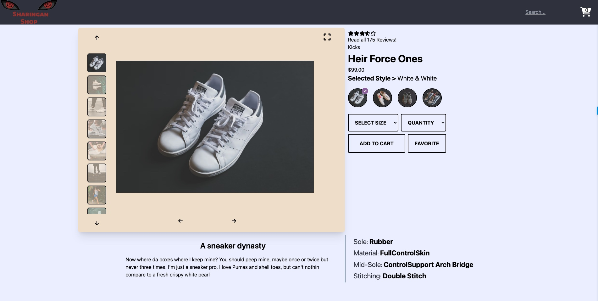
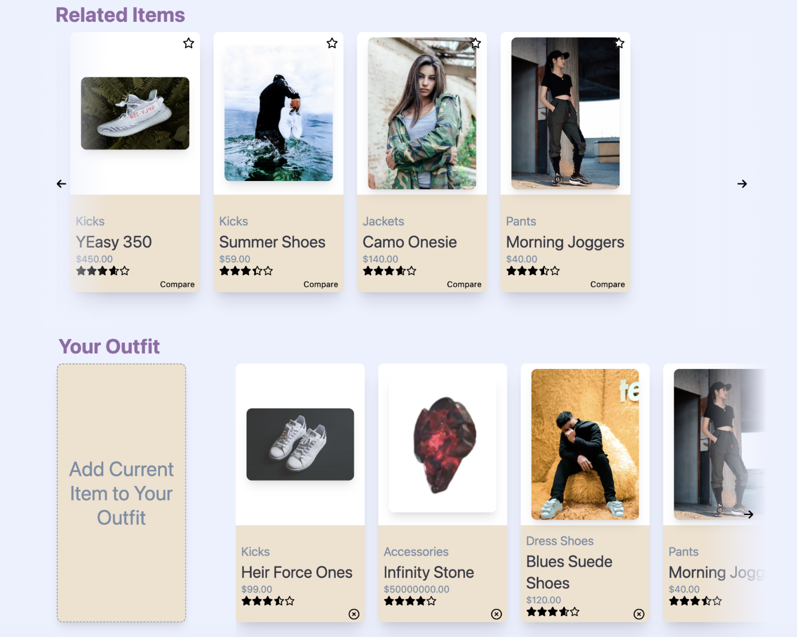
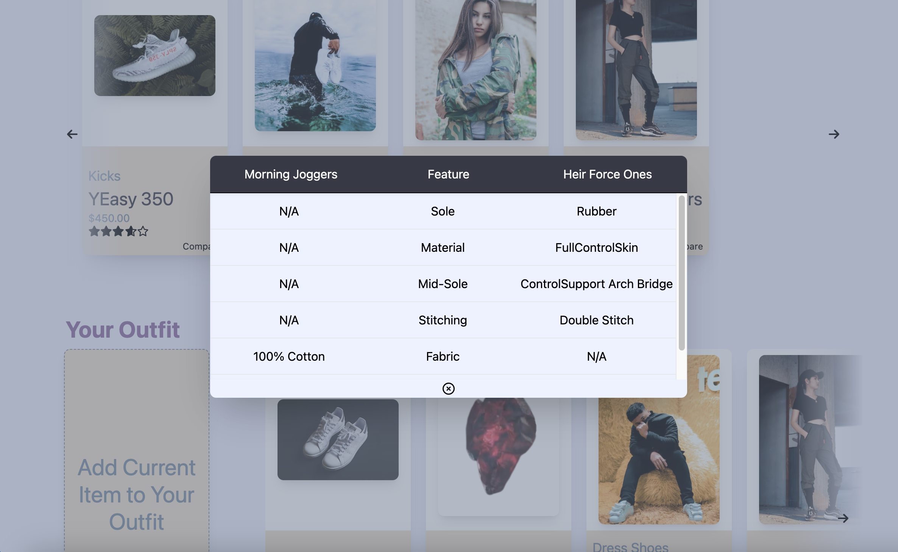
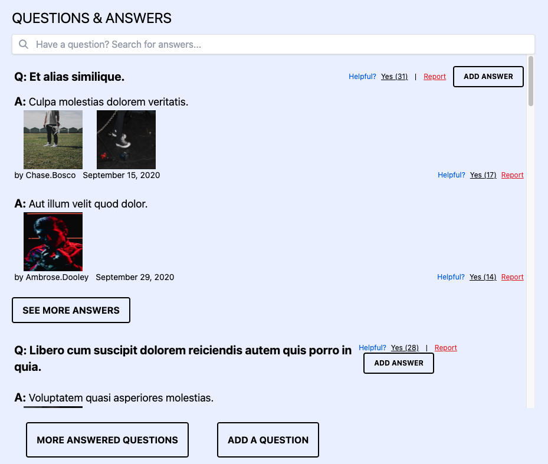
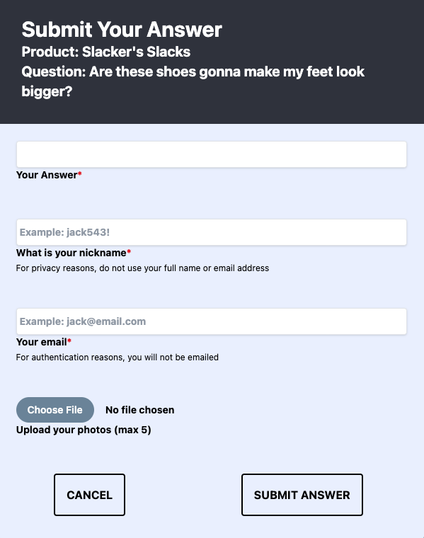
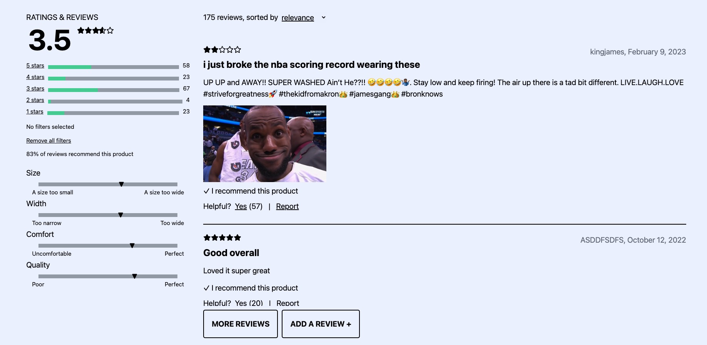
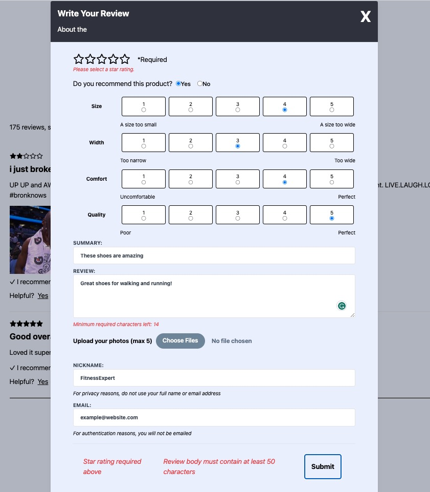

# Techstyles

A fashionable e-commerce site built for a pleasent user experience.

## Authors

[Nam Nguyen](https://www.github.com/nnguye47)\
[Aidan Fisher](https://www.github.com/aidanFisher97)\
[Andrew Ihn](https://www.github.com/roormade)\
[Kyle Stevens](https://www.github.com/kylestevens32)


## Built With


## Key Features
- An Overview section displaying a product and its styles.
- A Related Items and Comparison section where the user can view related items and build an outfit.
- A Q&A section used for asking, answering, and browsing user generated questions.
- A Ratings and Reviews section for writing, browsing, and filtering reviews.

## Overview
#### Features
- Interactive gallery with scrolling features
- Product information displaying the price, category, reviews, and name
- Interactive style selector to change the gallery images
- Size/Quantity selectors to add item to cart
- **Zoom In feature in progress**



## Related Products & Your Outfit
#### Features
- A carousel displaying a list of products related to the item in overview.
- A feature that allows the user to add items to a user-specific list called 'Your Outfit'.
- A modal to compare a related item to the overview item.



<details>
    <summary>See Comparison Details</summary>



</details>

## Questions & Answers
#### Features
- Search bar capable of filtering the Q&A list after 3 characters
- See More buttons render remaining Q&A
- Question and Answer modals to add user-based questions and answers



<details>
    <summary>See Q&A Details</summary>



</details>


## Ratings & Reviews
#### Features
- Filter reviews by both rating and query
- Visual represention of the breakdown of product ratings and characteristics
- A custom form for adding reviews





<details>
    <summary>See R&R Form</summary>





</details>


## Getting Started

Installation
- Clone the repository
    ```
        git clone https://github.com/SharinganTech/FEC-Main.git
    ```
- Install the dependencies
    ```
        npm install
    ```
- Copy example.env file and rename to .env with the following within
    ```
        API_TOKEN='Insert API Token'
    ```
- Run the following scripts
    ```
        npm run start
    ```
